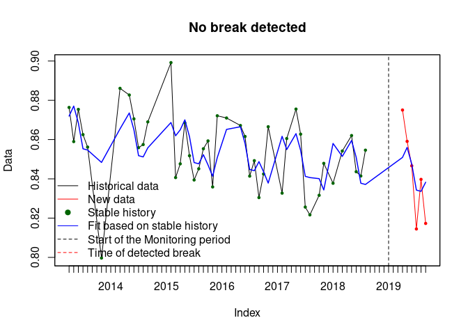
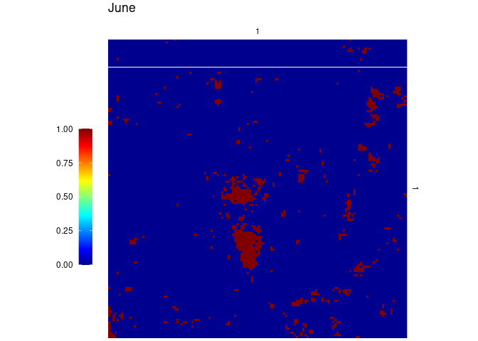
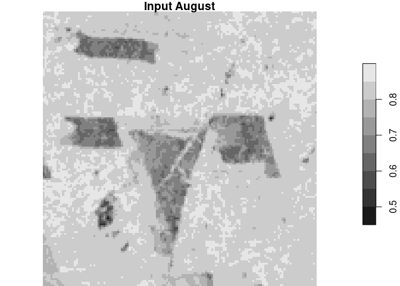

Near Real-Time Monitoring of Deforestation using Optical Remote Sensing Data
=============
Brian Pondi & Jonathan Bahlmann

Prerequisites
=============

Because most computations are taking some time, a lot of them have been
precomputed and uploaded to this repository. Input imagery however is
not available via this repository due to size. To build the markdown,
input Landsat time series must be downloaded [from
sciebo](https://uni-muenster.sciebo.de/s/d9BKPd1sVtFqvW4) and extracted
into the repository folder. Alongside with the toplevel files like
`main.Rmd`, that folder should then contain `landsat_monthly` and
`landsat_quarterly`. If there is a problem with the input data, please
contact us.

Introduction
============

Forests are known to be crucial part of the ecosystem as they purify
water and air. They are key in mitigating climate changes as they act as
a carbon sink and apart from that there are varieties of land-based
species that live in the forest (Pacheco et al., 2021). Forests in the
tropical are under threat due to deforestation. Deforestation in this
context refers to (UNFCCC 2001) definition which is the direct
human-induced conversion of forested land to do non-forested land.

In this research we focused on the Amazonia of Brazil because
deforestation that occurs in that region leads to loss of environmental
services that, while affecting Brazil the most, affect the whole world
(Fearnside, 1997a, 2008a). Environmental services of Amazonian forest
here include its roles in storing carbon, which avoids global warming
(Fearnside, 2000, 2016a; Nogueira et al., 2015), recycling of water in
also non-Amazonian areas (Arraut et al., 2012), and in maintenance of
biodiversity (Fearnside, 1999).

Carrying out near real-time monitoring of deforestation can help to curb
deforestation. Satellite sensors are greatly capable for this task
because they provide repeatable measurements that are consistent in both
spatial and temporal scale. This capability enables capturing of many
processes that can cause change, including natural cases like fires and
anthropogenic disturbances such as deforestation (Jin and Sader, 2005).

Our research focused on utilizing Optical Multi-spectral Remote Sensing
Imagery to carry out near real-time monitoring of deforestation. The
main challenge of optical satellite data specifically on the tropics is
that they cannot penetrate cloud cover. We therefore explored new
techniques such as a the Gapfill algorithm to predict missing values in
optical imagery time series data, i.e. to fill the cloud gaps. We then
used `bfastmonitor` of the bfast algorithm family to detect disturbances
in the gapfilled optical time series.

Of special interest was the presence of the mentioned cloud gaps, and
how they affect deforestation detection, i.e. we asked the question:
Does `bfastmonitor` perform better with stronger aggregated data? To
answer this question, we compared the same procedure for monthly and for
quarterly aggregated data sets.

We validated our results by using
[INPE](http://terrabrasilis.dpi.inpe.br/en/home-page/)
[PRODES](http://terrabrasilis.dpi.inpe.br/download/dataset/legal-amz-prodes/vector/yearly_deforestation.zip)
(more conservative, so very low false positive rate) and
[DETER](http://terrabrasilis.dpi.inpe.br/file-delivery/download/deter-amz/shape)
(automatized system, some false positives expected) deforestation data
as reference.

Methods
=======

Input Data and Preparations
---------------------------

The time series of Landsat 8 satellite images used for this research
were already provided in a state where cloud cover was already removed
sufficiently. The data covers the period 01-01-2013 to 31-12-2019 in row
001, paths 066 and 067.

To investigate the influence of different temporal aggregation
intervals, the input data was aggregated to a) a monthly and b) a
quarterly NDVI (Normalized Difference Vegetation Index) time series. For
this, the median was used. This resulted in a) 12 NDVI images per year
and b) 4 NDVI images per year, respectively.

Aggregating the different temporal intervals as seen in the [course
material](https://github.com/edzer/astd/blob/master/st.Rmd), only that
we chose another area of interest. Because `Gapfill` is very intense on
computation time, we had to settle for only 140x140 pixels. We then
selected an area with a diverse range of deforestation dates to be able
to do a differentiated evaluation.

    v = cube_view(srs="EPSG:3857", extent=list(left = -7338335, right = -7329987, top = -1018790, bottom = -1027138, t0 ="2013-01-01", t1 = "2019-12-31"), dx=60, dy=60, dt = "P1M", resampling = "average", aggregation = "median") # dt = "P3M"


    # calculate NDVI and export as GeoTIFF files at subfolder "L8cube_subregion"
    raster_cube(col, v, L8.clear_mask) %>%
     select_bands(c("B04", "B05")) %>%
     apply_pixel("(B05-B04)/(B05+B04)") %>%
     write_tif("smaller_monthly",prefix = "NDVI_")

The aggregated imagery time series are loaded as `stars` objects from
their directories. They are plotted to get an idea of what we are
dealing with here. The monthly aggreagtion can be seen on the left, the
quarterly aggregation on the right.

``` r
library(stars)
library(gapfill)
library(bfast)
library(zoo)
library(raster)
library(viridis)
```

``` r
subdir = "landsat_monthly"
f = paste0(subdir, "/", list.files(subdir))
st = merge(read_stars(f)) # make stars object
plot(st)
subdir = "landsat_quarterly"
f = paste0(subdir, "/", list.files(subdir))
st_q = merge(read_stars(f)) # make stars object
plot(st_q)
```


The reference PRODES and DETER data were then loaded and cropped.

``` r
# load PRODES data
prod <- read_sf("./yearly_deforestation/yearly_deforestation.shp")
prod_3857 <- st_make_valid(st_transform(prod, crs = st_crs(st)))
prod_crop <- st_crop(prod_3857, st) # clip
write_sf(prod_crop, "./yearly_deforestation/PRODES_cropped.shp", overwrite = TRUE)

deter <- read_sf("./yearly_deforestation/deter_public.shp")
deter_3857 <- st_make_valid(st_transform(deter, crs = st_crs(st)))
deter_crop <- st_crop(deter_3857, st)
write_sf(deter_crop, "./yearly_deforestation/DETER_cropped.shp", overwrite = TRUE)
```

An overview is given here, with the deforestation in our area of
interest colored by the year it occurred. There is no deforestation
prior to 2016, which promises a stable history period for applying
`bfastmonitor`. We also observe that in the less conservative DETER
data, more deforestation areas were detected.

``` r
prod <- read_sf("./deforestation_shapes/PRODES_cropped.shp")
dete <- read_sf("./deforestation_shapes/DETER_cropped.shp")

cols <- viridis::magma(4)
dete$VIEW_DATE <- as.numeric(format(as.Date(dete$VIEW_DATE, format="%d/%m/%Y"),"%Y")) # year as date
dete <- dete[dete$VIEW_DATE < 2020,] # defo. after 2019 is not of interest here

plot(prod["YEAR"], pal = cols[2:4], main = "PRODES Deforestation Data Colored by Year")
plot(dete["VIEW_DATE"], pal = cols, main = "DETER Deforestation Data Colored by Year")
```


Gapfill
-------

Prediction of missing values in satellite data are carried out using the
`gapfill` package in R. The gapfill approach was designed to carry out
predictions on satellite data that were recorded at equally spaced
points of time. Based on Gerber et. al 2016, they applied the algorithm
to MODIS NDVI data with cloud cover scenarios of up to 50% missing data.

Gapfill was appealing to this research because it’s capable of handling
large amounts of spatio-temporal data, it’s user friendly and tailored
to specific features of satellite imagery. The predictions of the
missing values are based on a subset-predict procedure, i.e. each
missing value is predicted separately by (1) selecting subsets of the
data that are in a neighborhood around the missing point in space and
time and (2) predicting the missing value based on the subset (Gerber
et. al, 2016). If a selected subset doesn’t fullfil the requirements
(enough non-empty images and non-missing values), the neighbourhood is
simply increased. If a suitable subset is found, a linear quantile
regression is used to interpolate the missing value. The temporal
neighbourhood is also used to adjust for seasonality (Gerber et. al,
2016).

### Prepare for Gapfill

`Gapfill` documentation tells us that as input, a 4-dimensional numeric
array is needed, with dimensions x, y, seasonal index (doy) and year.
These arrays are extracted as numeric vector from the input `stars` data
and then put into an array of the requested dimensions. An x-y-axis flip
is needed such that the function `Image`, that can render the
multidimensional arrays, displays the aoi in the correct orientation,
saving time and effort to convert the arrays back to `stars` objects.

``` r
prep_gapfill <- function(st, doy, ts) {
 # st is stars object, doy is day of year vector, ts is number of timesteps per year
 
 # get pixels of whole dataset
 imgdata <- c(st[,,,][[1]])

 # make labels
 xlab <- seq(from = attr(st, "dimensions")[[1]]$offset, by = attr(st, "dimensions")[[1]]$delta, length.out = attr(st, "dimensions")[[1]]$to)
 ylab <- seq(from = attr(st, "dimensions")[[2]]$offset, by = attr(st, "dimensions")[[2]]$delta, length.out = attr(st, "dimensions")[[2]]$to)
 years <- seq(2013,2019,1)

 # make array, transpose
 h <- array(imgdata, dim = c(140, 140, ts, 7), dimnames = list(xlab, ylab, doy, years))
 # x, y is switched between stars and these arrays
 h <- aperm(h, c(2,1,3,4))
 return(h)
}

doy_12 <- c(1, 32, 60, 91, 121, 152, 182, 213, 244, 274, 305, 335)
doy_4 <- c(1, 91, 182, 274)

ma_monthly <- prep_gapfill(st, doy_12, 12)
ma_quarter <- prep_gapfill(st_q, doy_4, 4)
```

In this research we also explored to tailor gapfill by customizing the
`iMax` parameter. It gives the maximum number of iterations of the
subset-predict procedure until `NA` is returned as predicted value
(Gerber, 2016). As it is defaulting to `Inf`, `Gapfill` can take hours
upon hours of computation. This is why we settled on using `iMax = 5`. A
comparison of the (negligible) effect of different `iMax` values can be
found in Appendix A).

``` r
d <- Gapfill(ma_monthly, iMax = 5)
saveRDS(d, "./monthly_iMax5_140_gapfilled.rds")
e <- Gapfill(ma_quarter, iMax = 5)
saveRDS(e, "./quarterly_iMax5_140_gapfilled.rds")
```

### Gapfill Results

To save computation time, gapfilled data was precomputed. Here is an
overview of the resulting imagery using the function `Image()` of
package `gapfill` that lets us visualize satllite data that is contained
in arrays with no spatial reference stored. The x-axis shows day of year
while the y-axis shows the year.

``` r
gf_monthly <- readRDS("monthly_iMax5_140_gapfilled.rds")
Image(gf_monthly$fill, zlim = c(0.2, 1)) + ggtitle("Gapfilled Monthly Data")
gf_quarterly <- readRDS("quarterly_iMax5_140_gapfilled.rds")
Image(gf_quarterly$fill, zlim = c(0.2, 1)) + ggtitle("Gapfilled Quarterly Data")
```


### Gapfill Results - Closeup

To have a closer look at what `Gapfill` does, the time period of October
to December 2013 is plotted here for comparison. First, the input data
is plotted. Below that, the gapfilled datasets are plotted.

``` r
# plot input data matrices
Image(ma_monthly[,,10:12,1], zlim = c(0.2, 1), colbarTitle = "NDVI") + ggtitle("Monthly Input Data, Oct - Dec 2013")
Image(ma_quarter[,,4,1], zlim = c(0.2, 1), colbarTitle = "NDVI") + ggtitle("Quarterly Input Data, Last Quarter 2013")

# plot gapfilled data matrices
Image(gf_monthly$fill[,,10:12,1], zlim = c(0.2, 1), colbarTitle = "NDVI") + ggtitle("Monthly Gapfilled Data, Oct - Dec 2013, iMax = 5")
Image(gf_quarterly$fill[,,4,1], zlim = c(0.2, 1), colbarTitle = "NDVI") + ggtitle("Quarterly Gapfilled Data, Last Quarter 2013, iMax = 5")
```


Just to see what the Gapfill algorithm is capable of achieving, observe
what it yields when letting `iMax` default to infity. This allows the
function to endlessly increase the neighbourhood for predicting `NA`
values, resulting in an image with no cloud gaps whatsoever (as long as
some input pixels are given, gapfill can not fill empty images).

``` r
gf_quarterly_inf <- readRDS("./appendix/quarterly_iMaxInf_140_gapfilled.rds")
Image(gf_quarterly_inf$fill[,,4,1], zlim = c(0.2, 1), colbarTitle = "NDVI") + ggtitle("Quarterly Gapfilled Data, Last Quarter 2013, with iMax=inf") # plotting quarterly gapfilled data with iMax=Inf
```


BFAST
-----

Near-real time monitoring of deforestation being the main object of this
study, we looked into a generic change detection approach for time
series by detecting and characterizing Breaks For Additive Seasonal and
Trend (BFAST). (Verbesselt et al., 2010) first applied BFAST in forested
areas of South Eastern Australia and it was able to detect and
characterize spatial and temporal changes in a forested landscape. BFAST
package is now publicly available on CRAN. Besides BFAST there exists a
function component named `bfastmonitor`, which is capable of carrying
out near real-time disturbance detection in satellite image time series
even if the data is not gap-filled (Verbesselt et al., 2013). A short
investigation into whether using Gapfill was actually helpful or not is
done in Appendix C).

`bfastmonitor` proves to be useful because gap-filling algorithm was not
able to completely predict all the missing values in the time series
data used in this study as some had some satellite images that had 100%
cloud cover, and bfast is able to handle gaps in the data. In
`bfastmonitor`, the data is split into a history and a monitoring
period. The “piecewise linear trend and seasonal model” (Verbesselt et.
al, 2010) used in bfast is then fitted to the part of the history that
is considered stable. A monitoring procesdure then checks the monitoring
timesteps for breaks. The algorithm was used in both monthly and
quarterly time series data.

### `bfastmonitor` Example

Let’s have a look at what `bfastmonitor` does by plotting two example
time series. We select a border area of an area that is deforested
(subset of time series in first plot). Then we let `bfastmonitor` run on
two example pixels (top-left and bottom-right corner). As expected, a
break is detected in the latter time series.

``` r
ext <- extent(-7337562,-7337134,-1020218,-1019648) # extent drawn on raster and then recreated here
plot(st_geometry(prod), main = "Overview of Example Time Series") # plot prodes shape
plot(as(st[,,,80], "Raster"), add = TRUE, ext = ext) # add clipped raster

Image(gf_monthly$fill[9:13, 16:20,6:10,7], colbarTitle = "NDVI", zlim = c(0.2, 1)) +
 ggtitle("Example Time Series Around Deforestation Edge. June - Oct 2019")
```


In the above plot, we can observe the deforestation process in detail:
How it progresses and first changes the NDVI gradually, then suddenly
(indicating clearcut). We show the two resulting `bfastmonitor` time
series below, the first one indicating no significantly large change,
and the second one detecting a break in late 2019.

``` r
x <- as.vector(gf_monthly$fill[9,16,,]) # ts of top-left pixel
y <- as.ts(zoo(x, seq(2013, by = .08333333, length.out = 84))) # as ts object
bf <- bfastmonitor(y, start = 2019) # bfmonitor
plot(bf) # plot

x <- as.vector(gf_monthly$fill[13,20,,]) # ts of bottom-right pixel
y <- as.ts(zoo(x, seq(2013, by = .08333333, length.out = 84))) # as ts object
bf <- bfastmonitor(y, start = 2019) # bfmonitor
plot(bf) # plot
```



### `bfastmonitor` on the Complete Tile

The above demonstrated `bfastmonitor` is then run on all pixels of the
aoi. This is done by the function `bfast_on_tile`, defined in the
following code block. It returns a matrix that is `TRUE` for all pixels
for which a breakpoint is detected and `FALSE` for all where no break is
found.

``` r
bfast_on_tile <- function(gapfill_matrix, by, ts, order) {
 # gapfill_matrix is a x*y*doy*year matrix, by is 1/doy, ts is # of timesteps, order is bfastmonitor order
 dims <- dim(gapfill_matrix)
 result <- matrix(rep(FALSE, dims[1]*dims[2]), ncol = dims[1]) # result is all FALSE
 for (i in 1:dims[1]) { # looping through x
 for (j in 1:dims[2]) { # looping through y
  raw_px_ts <- as.vector(gapfill_matrix[i,j,,]) # create pixel timeseries vector
  px_ts_obj <- as.ts(zoo(raw_px_ts, seq(2013, by = by, length.out = ts))) # make into ts object
  bfm_obj <- bfastmonitor(px_ts_obj, start = 2019, order = order) # bfastmonitor of pixel timeseries
  brkpoint <- bfm_obj$breakpoint
  if(!is.na(brkpoint)) { # if breakpoint is available..
  result[i,j] <- TRUE # .. write TRUE to solution raster
  } else {
  # FALSE
  }
 }
 }
 return(result)
}
```

This function is then run on our monthly and quarterly input data. While
the monthly time series is longer and narrowly timed, the quarterly data
has less timesteps with bigger intervals between them.

``` r
bfast_monthly2 <- bfast_on_tile(gf_monthly$fill, by = .08333333, ts = 84, order = 2)
bfast_quarter2 <- bfast_on_tile(gf_quarterly$fill, by = 0.25, ts = 28, order = 2)
# order = 2 was chosen because order 3 doesn't work on our quarterly aggreggated data
saveRDS(bfast_monthly2, "bfast_monthly2.rds")
saveRDS(bfast_quarter2, "bfast_quarter2.rds")
# warning: too few observations in history period
```

Precomputed BFAST tiles can then be loaded, but are not plotted yet.

``` r
bfast_monthly <- readRDS("bfast_monthly2.rds")
bfast_quarter <- readRDS("bfast_quarter2.rds")
```

To eliminate errors that may appear due to previously deforested areas
(\< 2019), these areas are simply excluded, according to PRODES
reference data. This is done only for PRODES data and not also for DETER
polygons to ensure that only pixels that were actually deforested are
taken out, as the goal of this research is to investigate whether
(Gapfil and) BFAST is able to detect deforestation. This task includes
being robust to other forest disturbances. We chose to take advantage of
the PRODES program here, since an actual near real-time monitoring
system could also incorporate PRODES data.

``` r
# to mask out previous deforestation
# <2019 = TRUE, !<2019 = FALSE
ras <- rasterize(prod, as(st[,,,5], "Raster"), "YEAR")
prodes_prev <- aperm(matrix(ras[], ncol = 140), c(2,1))
prodes_prev[prodes_prev < 2019] <- TRUE
prodes_prev[prodes_prev == 2019] <- FALSE
prodes_prev[is.na(prodes_prev)] <- FALSE

bfast_monthly[prodes_prev == 1] <- NA
bfast_quarter[prodes_prev == 1] <- NA
```

Validation
----------

The reference data is rasterized to the same array format that the
result data is held in, to make the plots comparable.

``` r
# rasterize reference data
# 2019 = TRUE, !2019 = FALSE
ras <- rasterize(prod, as(st[,,,5], "Raster"), "YEAR")
prodes <- aperm(matrix(ras[], ncol = 140), c(2,1))
prodes[prodes < 2019] <- FALSE
prodes[prodes == 2019] <- TRUE
prodes[is.na(prodes)] <- FALSE

rus <- rasterize(dete, as(st[,,,5], "Raster"), "VIEW_DATE")
rus[rus < 2019] <- 0
rus[rus > 2019] <- 0
rus[is.na(rus[])] <- 0
rus[rus != 0] <- 1
deter <- aperm(matrix(rus[], ncol = 140), c(2,1))

reference <- deter | prodes
```

Error matrices and various accuracies are calculated for each
classification. For this, the function `accuracies` is written, which
returns a list, containing Overall Accuracy, Producer’s Accuracies,
User’s Accuracies and Kappa value.

``` r
table1 <- addmargins(table(bfast_monthly, reference))
table2 <- addmargins(table(bfast_quarter, reference))

accuracies <- function(table1) {
 # overall accuracy
 P0 <- (table1[1] + table1[5]) / table1[9]
 # producer's accuracy, Probability of classifying a pixel correctly
 pa_f <- table1[1] / table1[3] # FALSE
 pa_t <- table1[5] / table1[6] # TRUE
 # user's accuracy, Probability of a pixel being the classified type
 ua_f <- table1[1] / table1[7] # FALSE
 ua_t <- table1[5] / table1[8] # TRUE
 # kappa
 # chance that both TRUE / FALSE randomly
 tr <- (table1[8] / table1[9]) * (table1[6] / table1[9])
 fr <- (table1[7] / table1[9]) * (table1[3] / table1[9])
 Pe <- tr + fr
 kappa <- (P0 - Pe) / (1 - Pe)
 
 return(list("Overall Accuracy" = P0*100, "Prod. Acc. FALSE" = pa_f*100, "Prod. Acc. TRUE" = pa_t*100, "User's Acc. FALSE" = ua_f*100, "User's Acc. TRUE" = ua_t*100, "Kappa" = kappa))
}
```

This concludes the applied methods of applying the combination of
`Gapfill` and `bfastmonitor` on the complete 7-year time series. That
leaves the question whether this combination could, in general, be used
in a near real-time monitoring system. A short investigation of this
question is done in Appendix D).

Results
=======

`Gapfill` and `bfastmonitor` were applied to both monthly and quarterly
aggregated Landsat time series to detect deforestation. As mentioned
earlier, PRODES and DETER Shapefiles were used to validate the results.

First, overview maps of the `bfastmonitor` - classifications are
printed. `TRUE/FALSE` are in red/purple, while `NA` values are black. In
the row below, rasterized reference data is shown: PRODES on the left,
and both PRODES and DETER data on the right.

``` r
# plot results
Image(bfast_monthly, colbarTitle = "TRUE/FALSE") + ggtitle("Monthly Data") + theme(plot.title = element_text(size=22))
Image(bfast_quarter, colbarTitle = "TRUE/FALSE") + ggtitle("Quarterly Data") + theme(plot.title = element_text(size=22))

# plot reference data
Image(prodes, colbarTitle = "TRUE/FALSE") + ggtitle("PRODES Data") + theme(plot.title = element_text(size=22))
Image(reference, colbarTitle = "TRUE/FALSE") + ggtitle("PRODES and DETER Data") + theme(plot.title = element_text(size=22))
```


Comparing the monthly aggregated result to the reference data below, we
observe that the general shape, count and area of deforestation pixels
is reflected in the result plot. There are also some scattered pixels
present that do not align with the reference data. Additionally, some
areas inside the areas classified as deforestation are wrongly marked
`FALSE`.

When looking at the quarterly data, we find an increase of the above
mentioned errors. There are more scattered pixels with no corresponding
reference areas and also some more areas that were falsely classified as
not deforested.

As for the reference data, the outcome of the research was closer to
DETER data compared to PRODES data which did not fully cover the
deforestation scenario (e.g in the areas east and west from the center
of the aoi). This is expected to some extent, as PRODES data is known to
be more conservative.

Additionally to the raster plots, error matrices and according accuracy
measurements were produced, plotted below.

``` r
addmargins(table(bfast_monthly, reference)) # monthly data error matrix
```

    ##              reference
    ## bfast_monthly FALSE  TRUE   Sum
    ##         FALSE 14309   468 14777
    ##         TRUE    929  2596  3525
    ##         Sum   15238  3064 18302

``` r
addmargins(table(bfast_quarter, reference)) # quarterly data error matrix
```

    ##              reference
    ## bfast_quarter FALSE  TRUE   Sum
    ##         FALSE 14069   727 14796
    ##         TRUE   1169  2337  3506
    ##         Sum   15238  3064 18302

``` r
array(c(accuracies(table1), accuracies(table2)), dim = c(6,2), dimnames = list(c("Overall Accuracy", "Prod. Acc. FALSE", "Prod. Acc. TRUE", "User's Acc. FALSE", "User's Acc. TRUE", "Kappa"), c("monthly", "quarterly"))) # comparison of accuracies
```

    ##                   monthly   quarterly
    ## Overall Accuracy  92.36695  89.64048 
    ## Prod. Acc. FALSE  93.9034   92.32839 
    ## Prod. Acc. TRUE   84.72585  76.27285 
    ## User's Acc. FALSE 96.83292  95.08651 
    ## User's Acc. TRUE  73.64539  66.65716 
    ## Kappa             0.7417141 0.6486349

When comparing the error matrices for monthly and quarterly data, we
notice an increase in false positives and false negatives in the
quarterly error matrix. The effect of said increase can be read from the
accuracies table.

For example had the monthly solution an error of omission value of 6.1%
for incorrectly classifying forested areas as deforested. It also had an
error of omission of 15.3% classifying deforested as forested. An
evaluation using error of commission, forested areas had 3.2% incorrect
classification and deforested areas had 26.4% incorrect classification.

Evaluating the quarterly data accuracy metrics, an error of omission
value of 7.7% for incorrectly classifying forested areas as deforested
is reported. The error of omission for classifying deforested as
forested was 23.7%. An evaluation using error of commission, forested
areas had 4.9% incorrect classification and deforested areas had 33.4%
incorrect classification.

It becomes clear that both Producer’s and User’s accuracies for the
deforestation class (`TRUE`) are worse than for forested areas, meaning
that deforestation itself is underestimated. We also observe a general
decline in accuracy (increase in error measurements) over both
aggregations that is especially strong for the above mentioned
accuracies, meaning deforestation is even more underestimated in the
monthly aggregation.

Finally, the results are summarized by taking a look at the Kappa value,
that is .1 better for monthly data (0.74 instead of 0.64).

Discussion
==========

While we conducted this research, we found several noteworthy things
about the combination of `Gapfill` and `bfastmonitor`: First, the
application of `Gapfill` and the resulting decrease in cloud gaps does
have a positive influence on the classification, as a .04 increase in
Kappa value was observed (Appendix C). The exact extent to which
gapfilling is done however does not matter as much (Appendix A).

In the previously stated results we further found that while
deforestation is in general underestimated, the effect increases when
using quarterly aggregated time series data. On the one hand, this
confirms the claim that BFAST is independent from data gaps (less cloud
gaps through stronger aggregation). On the other hand it raises the
question why quarterly data performs worse to such an extent.

The issue of data availability might play a role here, as found by
Schultz et. al 2016, where data availability was identified as a key
source of error in bfast deforestation detection. Considering that BFAST
fits a model on the part of a time series history that is considered
stable, it could be that that part becomes smaller and less stable with
decreasing number of observations, thus introducing error. This is
backed by the warning `"too few observations in history period"` that
was occasionally given by `bfastmonitor` on the quarterly aggregated
data.

Not taken into account here are e.g. the influence of the aggregation
method (median).

Conclusion
==========

In this research, we a) applied `gapfill` to cover for cloud gaps in a
multi-temporal dataset to then b) detect deforestation via
`bfastmonitor`, on both monthly and quarterly aggregated data.

As for the applied gapfilling, we found that computational load poses an
issue, as we had to settle for some remaining cloud gaps due to the very
intense time requirement of `Gapfill` to replace all gaps, even on such
a small area of interest. However, the problem of cloud gaps was at the
core of this research, which is why we also tried to eliminate gaps by
aggregating much stronger, as mentioned. Nonetheless, does the `Gapfill`
algorithm prove to be an interesting algorithm for gap-filling time
series data.

Via the `bfastmonitor` classification and PRODES and DETER reference
data we could then evaluate how that aggregation influences the quality
of a deforestation detection. We found that deforestation is in general
underestimated, but more so in the quarterly aggregated data. BFAST
itself proves to be a robust tool for such a detection, on ethe one hand
because of good overall results, on the other hand due to capabilities
of integration into a near real-time system (proof of concept in
Appendix D).

Sources of error that we not account for are e.g. the chosen aggregation
method and the deforestation reference data, which even though it is
benefiting from quite a strong methodology, is also subject to
misinterpretation and errors. We saw that using only PRODES data leads
to an underestimation of forest disturbance, while using DETER data
introduces uncertainty about the characteristics of the disturbance
event.

In conclusion, we advise against aggregating a time series too strongly
for deforestation detection with `bfastmonitor`, as to allow for a rich
and stable history time series, but we do advise towards using gapfill
methodology, as `Gapfill` has proven its capabilities.

References
==========

Arraut, J. M., Nobre, C., Barbosa, H. M., Obregon, G., and Marengo, J.
(2012). Aerial rivers and lakes: looking at large-scale moisture
transport and its relation to Amazonia and to subtropical rainfall in
South America. Journal of Climate, 25:543–556.

Fearnside, P.M. 1997a. Environmental services as a strategy for
sustainable development in rural Amazonia. Ecological Economics
20(1):53-70.

Fearnside, P.M. 1999. Biodiversity as an environmental service in
Brazil’s Amazonianforests: Risks, value and conservation. Environmental
Conservation 26(4):305-21.

Fearnside, P.M. 2000. Global warming and tropical land-use change:
Greenhouse gas emissions from biomass burning, decomposition and soils
in forest conversion, shifting cultivation and secondary vegetation.
Climatic Change 46(1-2):115-158

Fearnside, P.M. 2008a. Amazon forest maintenance as a source of
environmental services. Anais da Academia Brasileira de Ciências
80(1):101-114.

Gerber F, Furrer R, Schaepman-Strub G, de Jong R, Schaepman ME (2016)
Predicting missing values in spatio-temporal satellite data.

Jin, S. M., Sader, S. A., 2005. MODIS time-series imagery for forest
disturbance detection and quantification of patch size effects. Remote
Sensing of Environment 99 (4), 462–470.

Nogueira, E.M., A.M. Yanai, F.O.R. Fonseca, and P.M. Fearnside. 2015.
Carbon stock loss from deforestation through 2013 in Brazilian Amazonia.
Global Change Biology 21:1271–1292.

Pacheco, P., Mo, K., Dudley, N., Shapiro, A., Aguilar-Amuchastegui, N.,
Ling, P.Y., Anderson, C. and Marx, A. 2021. Deforestation fronts:
Drivers and responses in a changing world. WWF, Gland, Switzerland.

Schultz, M., Verbesselt, J., Avitabile, V., Souza, C. and Herold, M.,
“Error Sources in Deforestation Detection Using BFAST Monitor on Landsat
Time Series Across Three Tropical Sites,” in IEEE Journal of Selected
Topics in Applied Earth Observations and Remote Sensing, vol. 9, no. 8,
pp. 3667-3679, Aug. 2016, doi: 10.1109/JSTARS.2015.2477473.

UNFCCC 2001 Seventh Conf. of Parties: The Marrakech Accords (Bonn:
UNFCCC Secretariat) available at
<a href="https://unfccc.int/" class="uri">https://unfccc.int/</a>

Verbesselt, J., Hyndman, R., Newnham, G., & Culvenor, D. (2010).
Detecting trend and seasonal changes in satellite image time series.

Verbesselt, J., Zeileis, A., & Herold, M. (2013). Near real-time
disturbance detection using satellite image time series.

Appendix
========

A) Investigate `iMax` Parameter of `Gapfill` Function
-----------------------------------------------------

We investiagted different values for the `iMax` parameter in Gapfill
algorithm, and found that results were not significantly different (did
neither improve nor impair accuracies), although the calculation using
`iMax = infinite`, i.e. completely gapfilled data, resulted in the
highest accuracies. The code for this is found here.

Create gapfilled datasets and calculate bfast on tiles.

``` r
f <- Gapfill(ma_quarter) # iMax defaults to infinite
saveRDS(f, "./appendix/quarterly_iMaxInf_140_gapfilled.rds")
g <- Gapfill(ma_quarter, iMax = 1) #
saveRDS(g, "./appendix/quarterly_iMax1_140_gapfilled.rds")

bfast_quarter_inf <- bfast_on_tile(f$fill, by = 0.25, ts = 28, order = 2)
bfast_quarter_1 <- bfast_on_tile(g$fill, by = 0.25, ts = 28, order = 2)
saveRDS(bfast_quarter_inf, "./appendix/bfast_quarter_inf.rds")
saveRDS(bfast_quarter_1, "./appendix/bfast_quarter_1.rds")
```

Load results, see above for details.

``` r
# load bfast results
bfast_quarter_inf <- readRDS("./appendix/bfast_quarter_inf.rds")
bfast_quarter_1 <- readRDS("./appendix/bfast_quarter_1.rds")
# exclude existing deforestation
bfast_quarter_inf[prodes_prev == 1] <- NA
bfast_quarter_1[prodes_prev == 1] <- NA
# create accuracy tables
table3 <- addmargins(table(bfast_quarter_inf, reference))
table4 <- addmargins(table(bfast_quarter_1, reference))
# print
array(c(accuracies(table4), accuracies(table2), accuracies(table3)), dim = c(6,3), dimnames = list(c("Overall Accuracy", "Prod. Acc. FALSE", "Prod. Acc. TRUE", "User's Acc. FALSE", "User's Acc. TRUE", "Kappa"), c("iMax = 1", "iMax = 5", "iMax = inf")))
```

    ##                   iMax = 1  iMax = 5  iMax = inf
    ## Overall Accuracy  89.61862  89.64048  89.77707  
    ## Prod. Acc. FALSE  92.3087   92.32839  92.49902  
    ## Prod. Acc. TRUE   76.24021  76.27285  76.24021  
    ## User's Acc. FALSE 95.07909  95.08651  95.08871  
    ## User's Acc. TRUE  66.59065  66.65716  67.14573  
    ## Kappa             0.6479805 0.6486349 0.6521101

B) Investigate `order` Parameter of Function `bfastmonitor`
-----------------------------------------------------------

To make sure that by changing the value of parameter `order` from 3
(default) to 2, no completely unexpected effects are introduced, a quick
try-out is done here. The value 2 actually leads to the worst accuracy,
but the difference is not considered significant.

``` r
bfast_monthly1 <- bfast_on_tile(gf_monthly$fill, by = .08333333, ts = 84, order = 1)
saveRDS(bfast_monthly1, "./appendix/bfast_monthly1.rds")
bfast_monthly3 <- bfast_on_tile(gf_monthly$fill, by = .08333333, ts = 84, order = 3)
saveRDS(bfast_monthly3, "./appendix/bfast_monthly3.rds")
```

``` r
bfast_monthly1 <- readRDS("./appendix/bfast_monthly1.rds")
bfast_monthly3 <- readRDS("./appendix/bfast_monthly3.rds")

bfast_monthly1[prodes_prev == 1] <- NA
bfast_monthly3[prodes_prev == 1] <- NA
# create accuracy tables
table5 <- addmargins(table(bfast_monthly1, reference))
table6 <- addmargins(table(bfast_monthly3, reference))
# print
array(c(accuracies(table5), accuracies(table1), accuracies(table6)), dim = c(6,3), dimnames = list(c("Overall Accuracy", "Prod. Acc. FALSE", "Prod. Acc. TRUE", "User's Acc. FALSE", "User's Acc. TRUE", "Kappa"), c("order = 1", "order = 2", "order = 3")))
```

    ##                   order = 1 order = 2 order = 3
    ## Overall Accuracy  92.41613  92.36695  92.59097 
    ## Prod. Acc. FALSE  93.92309  93.9034   94.17246 
    ## Prod. Acc. TRUE   84.92167  84.72585  84.72585 
    ## User's Acc. FALSE 96.87288  96.83292  96.84168 
    ## User's Acc. TRUE  73.75283  73.64539  74.51206 
    ## Kappa             0.7434727 0.7417141 0.7480239

C) Gapfill vs No Gapfill
------------------------

To investigate what kind of effect the Gapfill function has in the first
place, since BFAST doesn’t necessarily need a gapfilling method.

``` r
bfast_monthly_nofill <- bfast_on_tile(ma_monthly, by = .08333333, ts = 84, order = 2)
saveRDS(bfast_monthly_nofill, "./appendix/bfast_monthly_nofill.rds")
```

``` r
bfast_monthly_nofill <- readRDS("./appendix/bfast_monthly_nofill.rds")

bfast_monthly_nofill[prodes_prev == 1] <- NA
# create accuracy tables
table7 <- addmargins(table(bfast_monthly_nofill, reference))
# print
array(c(accuracies(table1), accuracies(table7)), dim = c(6,2), dimnames = list(c("Overall Accuracy", "Prod. Acc. FALSE", "Prod. Acc. TRUE", "User's Acc. FALSE", "User's Acc. TRUE", "Kappa"), c("Gapfilled Data", "Original Data")))
```

    ##                   Gapfilled Data Original Data
    ## Overall Accuracy  92.36695       90.92449     
    ## Prod. Acc. FALSE  93.9034        92.01339     
    ## Prod. Acc. TRUE   84.72585       85.50914     
    ## User's Acc. FALSE 96.83292       96.93052     
    ## User's Acc. TRUE  73.64539       68.28251     
    ## Kappa             0.7417141      0.7042521

D) Near Real-Time Proof of Concept
----------------------------------

Previously we have tested the methods on complete time series and
started the BFAST algorithm at the beginning of 2019. This makes sense
as we wanted to compare the suitability of monthly vs. quarterly data
for using bfast, mainly in an effort to reduce cloud gaps via
aggregation + a gapfilling method. But what about evaluating each new
acquired image separately? This approach is tested here only on the
monthly aggregated data, since even that could hardly be called “near
real-time”. So in order to evaluate how `bfastmonitor` performs if the
very last pixel of the time series contains the deforestation event, the
time series are cut short. This is done on the original data, no gapfill
is applied.

``` r
plot(st[,,,73:84]) # complete year 2019
```


Code for calculating `bfastmonitor` on time series with variable length
is hidden since it is taken from the `bfast_on_tile` function seen
above.

The idea here is to run `bfastmonitor` each time a new image comes in,
which in this case is a monthly aggregated image (no gapfilling done).
As we see above, most timesteps of 2019 are useless anyway. Regardless,
bfast is run on timesteps for which DETER actually detected
deforestation, and results are then plotted next to their reference
data. (Code is also hidden, see `main.Rmd`). The output below is in the
following order:

1.  timesteps for which DETER detected deforestation in 2019
2.  accuracy measures as more data is added to the time series that is
    fed to `bfastmonitor`
3.  last tile of the input time series data, `bfastmonitor` detection
    and DETER reference data plotted by month

<!-- -->

    ## [1] "2019-09-03" "2019-09-09" "2019-08-08" "2019-06-06" "2019-07-10"
    ## [6] "2019-07-22" "2019-07-25" "2019-07-30"

    ##                   june      july      august    september
    ## Overall Accuracy  93.18878  88.95408  89.09184  89.68878 
    ## Prod. Acc. FALSE  96.6318   95.44839  93.79212  91.6612  
    ## Prod. Acc. TRUE   25.96859  27.37968  49.71292  78.02469 
    ## User's Acc. FALSE 96.2241   92.57152  93.98535  96.10381 
    ## User's Acc. TRUE  28.3105   38.81729  48.87112  61.27424 
    ## Kappa             0.2352352 0.2629319 0.4317756 0.6257878



E) Statement of Work
--------------------

Brian:

-   Project idea and development, initial research
-   Paper drafting

Jonathan:

-   Implementation
-   Draft review and finalization
