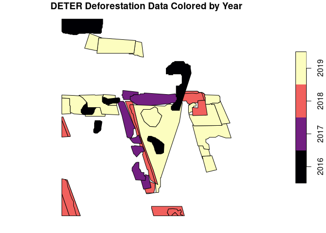

Introduction
============

Methods
=======

The time series Landsat 8 satellite images used for this research were
already provided in a state where cloud cover were already removed. The
data covers the period 01-01-2013 to 31-12-2019. The Landsat 8 data
covered row 001, paths 066 and 067.

The time series data was aggregated to a monthly and quarterly NDVI
(Normalized Difference Vegetation Index) data where the median pixel
values per row and column were selected. This resulted to 12 NDVI images
per year in the former approach and 4 NDVI images per year in the latter
approach

Prediction of missing values in satellite data are carried out using
gapfill package in R . The gapfill approach was designed to carry out
predictions on satellite data that were recorded at equally spaced
points of time. Based on Gerber et.al 2016 , they applied the algorithm
to MODIS NDVI data with cloud cover scenarios of 50% missing data. The
method was further compared to Gapfill-Python and TIMESAT and it
provided the most accurate prediction in terms of RMSE.

Gapfill was appealing to this research because it’s capable of handling
large spatio-temporal data, it’s user friendly and capability tailored
to specific features of different satellite images. The predictions of
the missing values are based on a subset-predict procedure, i.e., each
missing value is predicted separately by (1) selecting subsets of the
data that are in a neighborhood around the missing point and (2)
predicting the missing value based on the subset(Gerber, 2016).

In this research we also explored to tailor gapfill by customizing the
iMax parameter which is the maximum number of iterations until NA is
returned as predicted value (Gerber, 2016). The research compares the
iMax parameter at value 5 (five) for five iterations versus undefined
which results to infinite iterations by default.

BFAST(Breaks For Additive Season and Trend)

Input Data and Preparations
---------------------------

-   Package description
-   PRODES data sorted by years can be found here: [PRODES yearly
    deforestation](http://terrabrasilis.dpi.inpe.br/download/dataset/legal-amz-prodes/vector/yearly_deforestation.zip)
-   DETER data
    [DETER](http://terrabrasilis.dpi.inpe.br/file-delivery/download/deter-amz/shape)

As seen in “final.Rmd”. The subdirectory `L8cube_subregion` contains a
NDVI time series as single `.tif` files, a file per acquisition, as
input data.

``` r
library(stars)
library(gapfill)
library(bfast)
library(zoo)
library(raster)
library(viridis)
subdir = "landsat_monthly"
f = paste0(subdir, "/", list.files(subdir))
st = merge(read_stars(f)) # make stars object
plot(st)
subdir = "landsat_quarterly"
f = paste0(subdir, "/", list.files(subdir))
st_q = merge(read_stars(f)) # make stars object
plot(st_q)
```


``` r
# load PRODES data
prod <- read_sf("./yearly_deforestation/yearly_deforestation.shp")
prod_3857 <- st_make_valid(st_transform(prod, crs = st_crs(st)))
prod_crop <- st_crop(prod_3857, st) # clip
write_sf(prod_crop, "./yearly_deforestation/PRODES_cropped.shp", overwrite = TRUE)

deter <- read_sf("./yearly_deforestation/deter_public.shp")
deter_3857 <- st_make_valid(st_transform(deter, crs = st_crs(st)))
deter_crop <- st_crop(deter_3857, st)
write_sf(deter_crop, "./yearly_deforestation/DETER_cropped.shp", overwrite = TRUE)
```

``` r
prod <- read_sf("./yearly_deforestation/PRODES_cropped.shp")
dete <- read_sf("./yearly_deforestation/DETER_cropped.shp")

cols <- viridis::magma(6)
dete$VIEW_DATE <- as.numeric(format(as.Date(dete$VIEW_DATE, format="%d/%m/%Y"),"%Y")) # year as date

plot(prod["YEAR"], pal = cols[2:4], main = "PRODES Deforestation Data Colored by Year")
plot(dete["VIEW_DATE"], pal = cols, main = "DETER Deforestation Data Colored by Year")
```



Prepare for Gapfill
-------------------

`Gapfill` documentation tells us that as input, a 4-dimensional numeric
array is needed, with dimensions x, y, seasonal index (doy), year.

``` r
prep_gapfill <- function(st, doy, ts) {
  # st is stars object, doy is day of year vector, ts is number of timesteps per year
  
  # get pixels of whole dataset
  imgdata <- c(st[,,,][[1]])

  # make labels
  xlab <- seq(from = attr(st, "dimensions")[[1]]$offset, by = attr(st, "dimensions")[[1]]$delta, length.out = attr(st, "dimensions")[[1]]$to)
  ylab <- seq(from = attr(st, "dimensions")[[2]]$offset, by = attr(st, "dimensions")[[2]]$delta, length.out = attr(st, "dimensions")[[2]]$to)
  years <- seq(2013,2019,1)

  # make array, transpose
  h <- array(imgdata, dim = c(140, 140, ts, 7), dimnames = list(xlab, ylab, doy, years))
  # x, y is switched between stars and these arrays
  h <- aperm(h, c(2,1,3,4))
  return(h)
}

doy_12 <- c(1, 32, 60, 91, 121, 152, 182, 213, 244, 274, 305, 335)
doy_4 <- c(1, 91, 182, 274)

ma_monthly <- prep_gapfill(st, doy_12, 12)
ma_quarter <- prep_gapfill(st_q, doy_4, 4)
```

Gapfill
-------

``` r
d <- Gapfill(ma_monthly, iMax = 5)
saveRDS(d, "./monthly_iMax5_140_gapfilled.rds")
e <- Gapfill(ma_quarter, iMax = 5)
saveRDS(e, "./quarterly_iMax5_140_gapfilled.rds")
```

### Gapfill Results

``` r
gf_monthly <- readRDS("monthly_iMax5_140_gapfilled.rds")
Image(gf_monthly$fill, zlim = c(0.2, 1)) + ggtitle("Gapfilled Monthly Data")
gf_quarterly <- readRDS("quarterly_iMax5_140_gapfilled.rds")
Image(gf_quarterly$fill, zlim = c(0.2, 1)) + ggtitle("Gapfilled Quarterly Data")
```


### Gapfill Results - Closeup

Here, October to December of 2013 are plotted for comparison. First, The
input data is plotted. Below that, the gapfilled dataset are plotted.

``` r
Image(ma_monthly[,,10:12,1], zlim = c(0.2, 1)) + ggtitle("Monthly Input Data, Oct - Dec 2013")
Image(ma_quarter[,,4,1], zlim = c(0.2, 1)) + ggtitle("Quarterly Input Data, Last Quarter 2013")
```


``` r
Image(gf_monthly$fill[,,10:12,1], zlim = c(0.2, 1)) + ggtitle("Monthly Gapfilled Data, Oct - Dec 2013, iMax = 5")
Image(gf_quarterly$fill[,,4,1], zlim = c(0.2, 1)) + ggtitle("Quarterly Gapfilled Data, Last Quarter 2013, iMax = 5")
```


Just to see what the Gapfill algorithm is capable of achieving, observe
what it yields when letting `iMax` default to inifity. This allows the
function to endlessly increase the neighbourhood for predicting `NA`
values.

``` r
gf_quarterly_inf <- readRDS("quarterly_iMaxInf_140_gapfilled.rds")
Image(gf_quarterly_inf$fill[,,4,1], zlim = c(0.2, 1)) + ggtitle("Quarterly Gapfilled Data, Last Quarter 2013, with iMax=inf")
```


Calculate BFAST Over AOI
------------------------

``` r
bfast_on_tile <- function(gapfill_matrix, by, ts, order) {
  dims <- dim(gapfill_matrix)
  result <- matrix(rep(FALSE, dims[1]*dims[2]), ncol = dims[1])
  for (i in 1:dims[1]) { # looping through x
    for (j in 1:dims[2]) { # loops through y
      raw_px_ts <- as.vector(gapfill_matrix[i,j,,]) # create pixel timeseries vector
      px_ts_obj <- as.ts(zoo(raw_px_ts, seq(2013, by = by, length.out = ts))) # make into ts object
      bfm_obj <- bfastmonitor(px_ts_obj, start = 2019, order = order) # bfastmonitor of pixel timeseries
      brkpoint <- bfm_obj$breakpoint
      if(!is.na(brkpoint)) { # if breakpoint is available..
        result[i,j] <- TRUE # .. write TRUE to solution raster
      } else {
        # FALSE
      }
    }
  }
  return(result)
}

bfast_monthly2 <- bfast_on_tile(gf_monthly$fill, by = .08333333, ts = 84, order = 2)
bfast_quarter2 <- bfast_on_tile(gf_quarterly$fill, by = 0.25, ts = 28, order = 2)
# order = 2 was chosen because order 3 doesn't work on our quarterly aggreggated data
saveRDS(bfast_monthly2, "bfast_monthly2.rds")
saveRDS(bfast_quarter2, "bfast_quarter2.rds")
# warning: too few observations in history period
```

``` r
bfast_monthly <- readRDS("bfast_monthly2.rds")
bfast_quarter <- readRDS("bfast_quarter2.rds")
```

To eliminate errors that may appear in already deforested areas, these
arreas are simply excluded, according to PRODES reference data.

``` r
# rasterize reference data
# 2019 = TRUE, !2019 = FALSE
ras <- rasterize(prod, as(st[,,,5], "Raster"), "YEAR")
prodes <- aperm(matrix(ras[], ncol = 140), c(2,1))
prodes[prodes < 2019] <- FALSE
prodes[prodes == 2019] <- TRUE
prodes[is.na(prodes)] <- FALSE

rus <- rasterize(dete, as(st[,,,5], "Raster"), "VIEW_DATE")
rus[rus < 2019] <- 0
rus[rus > 2019] <- 0
rus[is.na(rus[])] <- 0
rus[rus != 0] <- 1
deter <- aperm(matrix(rus[], ncol = 140), c(2,1))

# to mask out previous deforestation
# <2019 = TRUE, !<2019 = FALSE
prodes_prev <- aperm(matrix(ras[], ncol = 140), c(2,1))
prodes_prev[prodes_prev < 2019] <- TRUE
prodes_prev[prodes_prev == 2019] <- FALSE
prodes_prev[is.na(prodes_prev)] <- FALSE

# not used, PRODES more conservative
deter_prev <- aperm(matrix(rasterize(dete, as(st[,,,5], "Raster"), "VIEW_DATE")[], ncol = 140), c(2,1))
deter_prev[deter_prev < 2019] <- TRUE
deter_prev[deter_prev >= 2019] <- FALSE
deter_prev[is.na(deter_prev)] <- FALSE

reference <- deter | prodes

bfast_monthly[prodes_prev == 1] <- FALSE
bfast_quarter[prodes_prev == 1] <- FALSE
```

``` r
table1 <- addmargins(table(bfast_monthly, reference))
table2 <- addmargins(table(bfast_quarter, reference))

accuracies <- function(table1) {
  # overall accuracy
  P0 <- (table1[1] + table1[5]) / table1[9]
  # producer's accuracy, Probability of classifying a pixel correctly
  pa_f <- table1[1] / table1[3] # FALSE
  pa_t <- table1[5] / table1[6] # TRUE
  # user's accuracy, Probability of a pixel being the classified type
  ua_f <- table1[1] / table1[7] # FALSE
  ua_t <- table1[5] / table1[8] # TRUE
  # kappa
  # chance that both TRUE / FALSE randomly
  tr <- (table1[8] / table1[9]) * (table1[6] / table1[9])
  fr <- (table1[7] / table1[9]) * (table1[3] / table1[9])
  Pe <- tr + fr
  kappa <- (P0 - Pe) / (1 - Pe)
  
  return(list("Overall Accuracy" = P0*100, "Prod. Acc. FALSE" = pa_f*100, "Prod. Acc. TRUE" = pa_t*100, "User's Acc. FALSE" = ua_f*100, "User's Acc. TRUE" = ua_t*100, "Kappa" = kappa))
}
```

Results
=======

``` r
Image(bfast_monthly, colbarTitle = "TRUE/FALSE") + ggtitle("Monthly Data") + theme(plot.title = element_text(size=22))
Image(bfast_quarter, colbarTitle = "TRUE/FALSE") + ggtitle("Quarterly Data") + theme(plot.title = element_text(size=22))

Image(prodes, colbarTitle = "TRUE/FALSE") + ggtitle("PRODES Data") + theme(plot.title = element_text(size=22))
Image(reference, colbarTitle = "TRUE/FALSE") + ggtitle("PRODES and DETER Data") + theme(plot.title = element_text(size=22))
```


``` r
addmargins(table(bfast_monthly, reference))
```

    ##              reference
    ## bfast_monthly FALSE  TRUE   Sum
    ##         FALSE 15608   467 16075
    ##         TRUE    929  2596  3525
    ##         Sum   16537  3063 19600

``` r
addmargins(table(bfast_quarter, reference))
```

    ##              reference
    ## bfast_quarter FALSE  TRUE   Sum
    ##         FALSE 15368   726 16094
    ##         TRUE   1169  2337  3506
    ##         Sum   16537  3063 19600

``` r
array(c(accuracies(table1), accuracies(table2)), dim = c(6,2), dimnames = list(c("Overall Accuracy", "Prod. Acc. FALSE", "Prod. Acc. TRUE", "User's Acc. FALSE", "User's Acc. TRUE", "Kappa"), c("monthly", "quarterly")))
```

    ##                   monthly  quarterly
    ## Overall Accuracy  92.87755 90.33163 
    ## Prod. Acc. FALSE  94.38229 92.931   
    ## Prod. Acc. TRUE   84.75351 76.29775 
    ## User's Acc. FALSE 97.09487 95.489   
    ## User's Acc. TRUE  73.64539 66.65716 
    ## Kappa             0.745546 0.6537672

Discussion
==========

Conclusion
==========

References
==========

Gerber F, Furrer R, Schaepman-Strub G, de Jong R, Schaepman ME (2016)
Predicting missing values in spatio-temporal satellite data.

Verbesselt, J., Hyndman, R., Newnham, G., & Culvenor, D. (2010).
Detecting trend and seasonal changes in satellite image time series.

Verbesselt, J., Zeileis, A., & Herold, M. (2013). Near real-time
disturbance detection using satellite image time series.

Appendix
========

A) Investigate iMax Parameter
-----------------------------

We investiagted different values for the `iMax` parameter in Gapfill
algorithm, and found that results were not significantly different (did
neither improve nor impair accuracies), although the calculation using
`iMax = infinite`, i.e. completely gapfilled data, resulted in the
highest accuracies. The code for this is found here.

Create gapfilled datasets and calculate bfast on tiles.

``` r
f <- Gapfill(ma_quarter) # iMax defaults to infinite
saveRDS(f, "./quarterly_iMaxInf_140_gapfilled.rds")
g <- Gapfill(ma_quarter, iMax = 1) #
saveRDS(g, "./quarterly_iMax1_140_gapfilled.rds")

bfast_quarter_inf <- bfast_on_tile(f$fill, by = 0.25, ts = 28, order = 2)
bfast_quarter_1 <- bfast_on_tile(g$fill, by = 0.25, ts = 28, order = 2)
saveRDS(bfast_quarter_inf, "bfast_quarter_inf.rds")
saveRDS(bfast_quarter_1, "bfast_quarter_1.rds")
```

Load results, see above for details.

``` r
# load bfast results
bfast_quarter_inf <- readRDS("bfast_quarter_inf.rds")
bfast_quarter_1 <- readRDS("bfast_quarter_1.rds")
# exclude existing deforestation
bfast_quarter_inf[prodes_prev == 1] <- FALSE
bfast_quarter_1[prodes_prev == 1] <- FALSE
# create accuracy tables
table3 <- addmargins(table(bfast_quarter_inf, reference))
table4 <- addmargins(table(bfast_quarter_1, reference))
# print
array(c(accuracies(table4), accuracies(table2), accuracies(table3)), dim = c(6,3), dimnames = list(c("Overall Accuracy", "Prod. Acc. FALSE", "Prod. Acc. TRUE", "User's Acc. FALSE", "User's Acc. TRUE", "Kappa"), c("iMax = 1", "iMax = 5", "iMax = inf")))
```

    ##                   iMax = 1  iMax = 5  iMax = inf
    ## Overall Accuracy  90.31122  90.33163  90.45918  
    ## Prod. Acc. FALSE  92.91286  92.931    93.08823  
    ## Prod. Acc. TRUE   76.2651   76.29775  76.2651   
    ## User's Acc. FALSE 95.48223  95.489    95.49035  
    ## User's Acc. TRUE  66.59065  66.65716  67.14573  
    ## Kappa             0.6531235 0.6537672 0.6571723
