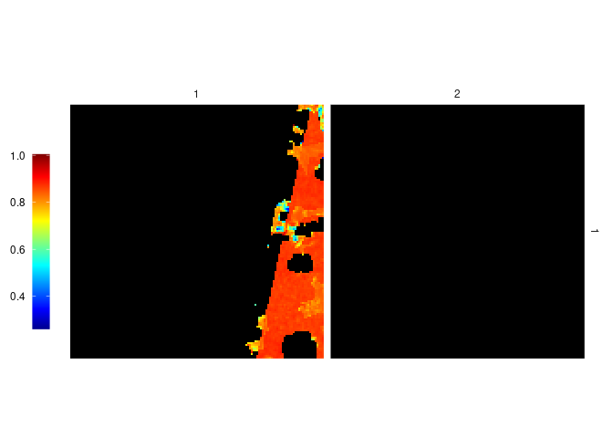
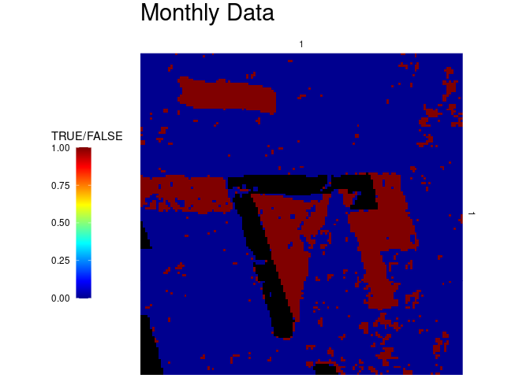
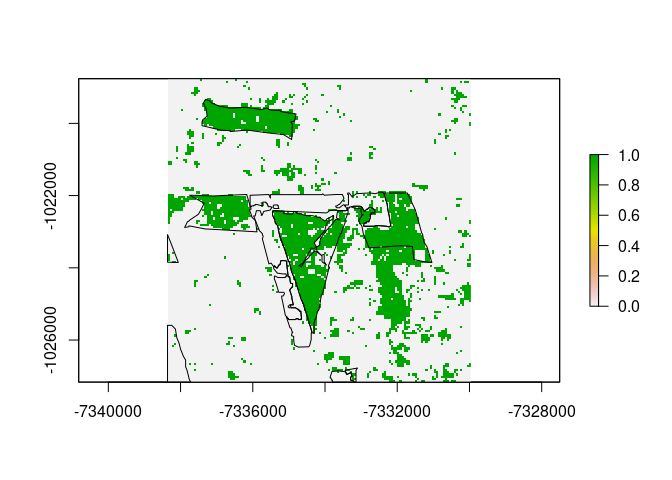

-   Observe structure: Intro, Methods, Results, Discussion, Conclusion

Introduction
============

Methods
=======

The time series Landsat 8 satellite images used for this research were
already provided in a state where cloud cover were already removed. The
data covers the period 01-01-2013 to 31-12-2019. The Landsat 8 data
covered row 001, paths 066 and 067.

The time series data was aggregated to a monthly and quarterly NDVI
(Normalized Difference Vegetation Index) data where the median pixel
values per row and column were selected. This resulted to 12 NDVI images
per year in the former approach and 4 NDVI images per year in the latter
approach

Prediction of missing values in satellite data are carried out using
gapfill package in R . The gapfill approach was designed to carry out
predictions on satellite data that were recorded at equally spaced
points of time. Based on Gerber et.al 2016 , they applied the algorithm
to MODIS NDVI data with cloud cover scenarios of 50% missing data. The
method was further compared to Gapfill-Python and TIMESAT and it
provided the most accurate prediction in terms of RMSE.

Gapfill was appealing to this research because it’s capable of handling
large spatio-temporal data, it’s user friendly and capability tailored
to specific features of different satellite images. The predictions of
the missing values are based on a subset-predict procedure, i.e., each
missing value is predicted separately by (1) selecting subsets of the
data that are in a neighborhood around the missing point and (2)
predicting the missing value based on the subset(Gerber, 2016).

In this research we also explored to tailor gapfill by customizing the
iMax parameter which is the maximum number of iterations until NA is
returned as predicted value (Gerber, 2016). The research compares the
iMax parameter at value 5 (five) for five iterations versus undefined
which results to infinite iterations by default.

BFAST(Breaks For Additive Season and Trend)

Input Data and Preparations
---------------------------

-   Package description
-   PRODES data sorted by years can be found here: [PRODES yearly
    deforestation](http://terrabrasilis.dpi.inpe.br/download/dataset/legal-amz-prodes/vector/yearly_deforestation.zip)

As seen in “final.Rmd”. The subdirectory `L8cube_subregion` contains a
NDVI time series as single `.tif` files, a file per acquisition, as
input data.

``` r
library(stars)
library(gapfill)
library(bfast)
library(zoo)
library(raster)
subdir = "landsat_monthly"
subdir = "landsat_quarterly"
f = paste0(subdir, "/", list.files(subdir))
st = merge(read_stars(f)) # make stars object
plot(st)
```


``` r
# load PRODES data
# prod <- read_sf("./yearly_deforestation/yearly_deforestation.shp")
# prod_3857 <- st_make_valid(st_transform(prod, crs = st_crs(st)))
# prod_crop <- st_crop(prod_3857, st) # clip
# write_sf(prod_crop, "./yearly_deforestation/PRODES_cropped.shp", overwrite = TRUE)
prod <- read_sf("./yearly_deforestation/PRODES_cropped.shp")
# prod <- prod[prod$YEAR < 2019,]
```

``` r
# whats in it?
# plot(st)
plot(prod["YEAR"])
```


Prepare for Gapfill
-------------------

`Gapfill` documentation tells us that as input, a 4-dimensional numeric
array is needed, with dimensions x, y, seasonal index (doy), year.

``` r
# get pixels of whole dataset
imgdata <- c(st[,,,][[1]])

# make labels
xlab <- seq(from = attr(st, "dimensions")[[1]]$offset, by = attr(st, "dimensions")[[1]]$delta, length.out = attr(st, "dimensions")[[1]]$to)
ylab <- seq(from = attr(st, "dimensions")[[2]]$offset, by = attr(st, "dimensions")[[2]]$delta, length.out = attr(st, "dimensions")[[2]]$to)
doi <- c(1, 32, 60, 91, 121, 152, 182, 213, 244, 274, 305, 335)
doi <- c(1, 91, 182, 274)
years <- seq(2013,2019,1)

# make array, transpose
h <- array(imgdata, dim = c(140, 140, 4, 7), dimnames = list(xlab, ylab, doi, years))
h <- aperm(h, c(2,1,3,4))

# all
Image(h[,,2,3:4])
```



``` r
# original stars
plot(st[,,,c(5, 17)])
```


Gapfill
-------

``` r
# d <- Gapfill(h, iMax = 5)
# saveRDS(d, "./iMax5_140_gapfilled_quarterly.rds")
gf_monthly <- readRDS("monthly_iMax5_140_gapfilled.rds")
Image(gf_monthly$fill)
```


``` r
gf_quarterly <- readRDS("quarterly_iMax5_140_gapfilled.rds")
Image(gf_quarterly$fill)
```


BFAST Test
----------

``` r
# ts of a pixel
x <- as.vector(gf_monthly$fill[15,20,,])
# time must be given scaled to 1. -> monthly -> 1/12 = .08333333
# zoo must also be used in between, exactly as in ?bfastmonitor example
y <- as.ts(zoo(x, seq(2013, by = .08333333, length.out = 84))) 
bf <- bfastmonitor(y, start = 2019, order = 3, verbose = TRUE) # 2019,6 works but monitoring period is then off chart
plot(bf)

x1 <- as.vector(gf_quarterly$fill[15,20,,])
y1 <- as.ts(zoo(x1, seq(2013, by = .24999999, length.out = 28))) 
bf1 <- bfastmonitor(y1, start = 2019, order = 2, verbose = TRUE) # 2019,6 works but monitoring period is then off chart
plot(bf1)
```

Calculate BFAST Over AOI
------------------------

``` r
bfast_on_tile <- function(gapfill_matrix, by, ts, order) {
  dims <- dim(gapfill_matrix)
  result <- matrix(rep(FALSE, dims[1]*dims[2]), ncol = dims[1])
  for (i in 1:dims[1]) { # looping through x
    for (j in 1:dims[2]) { # loops through y
      raw_px_ts <- as.vector(gapfill_matrix[i,j,,])
      px_ts_obj <- as.ts(zoo(raw_px_ts, seq(2013, by = by, length.out = ts)))
      bfm_obj <- bfastmonitor(px_ts_obj, start = 2019, order = order)
      brkpoint <- bfm_obj$breakpoint
      if(!is.na(brkpoint)) {
        result[i,j] <- TRUE
      } else {
        # FALSE
      }
    }
  }
  return(result)
}

bfast_monthly3 <- bfast_on_tile(gf_monthly$fill, by = .08333333, ts = 84, order = 3)
bfast_monthly2 <- bfast_on_tile(gf_monthly$fill, by = .08333333, ts = 84, order = 2)
bfast_quarter2 <- bfast_on_tile(gf_quarterly$fill, by = 0.25, ts = 28, order = 2)
saveRDS(bfast_monthly3, "bfast_monthly3.rds")
saveRDS(bfast_monthly2, "bfast_monthly2.rds")
saveRDS(bfast_quarter2, "bfast_quarter2.rds")
# warning: too few observations in history period
```

``` r
# bfast_monthly3 <- readRDS("bfast_monthly3.rds")
bfast_monthly2 <- readRDS("bfast_monthly2.rds")
bfast_quarter2 <- readRDS("bfast_quarter2.rds")
```

``` r
# rasterize PRODES data
ras <- rasterize(prod, as(st[,,,5], "Raster"), "YEAR")
prodes <- aperm(matrix(ras[], ncol = 140), c(2,1))
prodes[prodes < 2019] <- FALSE
prodes[prodes == 2019] <- TRUE
prodes[is.na(prodes)] <- FALSE

# to mask out previous deforestation
prodes_prev <- aperm(matrix(ras[], ncol = 140), c(2,1))
prodes_prev[prodes_prev < 2019] <- TRUE
prodes_prev[prodes_prev == 2019] <- FALSE
prodes_prev[is.na(prodes_prev)] <- FALSE

bfast_monthly2_prev <- bfast_monthly2
bfast_monthly2_prev[prodes_prev == 1] <- NA

bfast_quarter2_prev <- bfast_quarter2
bfast_quarter2_prev[prodes_prev == 1] <- NA
```

``` r
table1 <- addmargins(table(bfast_monthly2, prodes))
table2 <- addmargins(table(bfast_quarter2, prodes))

accuracies <- function(table1) {
  # overall accuracy
  P0 <- (table1[1] + table1[5]) / table1[9]
  # error of omission, wrong in respect to reference data
  # table1[2] / table1[3] # FALSE
  # table1[4] / table1[6] # TRUE
  # error of commission, wrong in respect to classified data
  # table1[4] / table1[7] # FALSE
  # table1[2] / table1[8] # TRUE
  # producer's accuracy, Probability of classifying a pixel correctly
  pa_f <- table1[1] / table1[3] # FALSE
  pa_t <- table1[5] / table1[6] # TRUE
  # user's accuracy, Probability of a pixel being the classified type
  ua_f <- table1[1] / table1[7] # FALSE
  ua_t <- table1[5] / table1[8] # TRUE
  # kappa
  # chance that both TRUE / FALSE randomly
  tr <- (table1[8] / table1[9]) * (table1[6] / table1[9])
  fr <- (table1[7] / table1[9]) * (table1[3] / table1[9])
  Pe <- tr + fr
  kappa <- (P0 - Pe) / (1 - Pe)
  
  return(list("Overall Accuracy" = P0*100, "Prod. Acc. FALSE" = pa_f, "Prod. Acc. TRUE" = pa_t, "User's Acc. FALSE" = ua_f, "User's Acc. TRUE" = ua_t, "Kappa" = kappa))
}
```

Results
=======

``` r
Image(bfast_monthly2) + ggtitle("Monthly Data") + theme(plot.title = element_text(size=22))
Image(bfast_quarter2) + ggtitle("Quarterly Data") + theme(plot.title = element_text(size=22))
Image(prodes) + ggtitle("PRODES Data") + theme(plot.title = element_text(size=22))

table1
```

    ##               prodes
    ## bfast_monthly2     0     1   Sum
    ##          FALSE 15599   170 15769
    ##          TRUE   1734  2097  3831
    ##          Sum   17333  2267 19600

``` r
table2
```

    ##               prodes
    ## bfast_quarter2     0     1   Sum
    ##          FALSE 15662   374 16036
    ##          TRUE   1671  1893  3564
    ##          Sum   17333  2267 19600

``` r
array(c(accuracies(table1), accuracies(table2)), dim = c(6,2), dimnames = list(c("Overall Accuracy", "Prod. Acc. FALSE", "Prod. Acc. TRUE", "User's Acc. FALSE", "User's Acc. TRUE", "Kappa"), c("monthly", "quarterly")))
```

    ##                   monthly   quarterly
    ## Overall Accuracy  90.28571  89.56633 
    ## Prod. Acc. FALSE  0.8999596 0.9035943
    ## Prod. Acc. TRUE   0.925011  0.8350243
    ## User's Acc. FALSE 0.9892194 0.9766775
    ## User's Acc. TRUE  0.5473767 0.5311448
    ## Kappa             0.6346743 0.5915353

``` r
# remove already deforested areas
ras[] <- bfast_monthly2
plot(ras)
plot(st_geometry(prod), add = TRUE)

ras[] <- bfast_quarter2
plot(ras)
plot(st_geometry(prod), add = TRUE)


array(c(accuracies(addmargins(table(bfast_monthly2_prev, prodes))), accuracies(addmargins(table(bfast_quarter2_prev, prodes)))), dim = c(6,2), dimnames = list(c("Overall Accuracy", "Prod. Acc. FALSE", "Prod. Acc. TRUE", "User's Acc. FALSE", "User's Acc. TRUE", "Kappa"), c("monthly", "quarterly")))
```

    ##                   monthly   quarterly
    ## Overall Accuracy  91.26871  89.14326 
    ## Prod. Acc. FALSE  0.9109448 0.8994075
    ## Prod. Acc. TRUE   0.925011  0.8350243
    ## User's Acc. FALSE 0.9884956 0.9747229
    ## User's Acc. TRUE  0.5948936 0.5399315
    ## Kappa             0.6751202 0.5948577



Discussion
==========

Conclusion
==========

References
==========

Gerber F, Furrer R, Schaepman-Strub G, de Jong R, Schaepman ME (2016)
Predicting missing values in spatio-temporal satellite data.

Verbesselt, J., Hyndman, R., Newnham, G., & Culvenor, D. (2010).
Detecting trend and seasonal changes in satellite image time series.

Verbesselt, J., Zeileis, A., & Herold, M. (2013). Near real-time
disturbance detection using satellite image time series.
